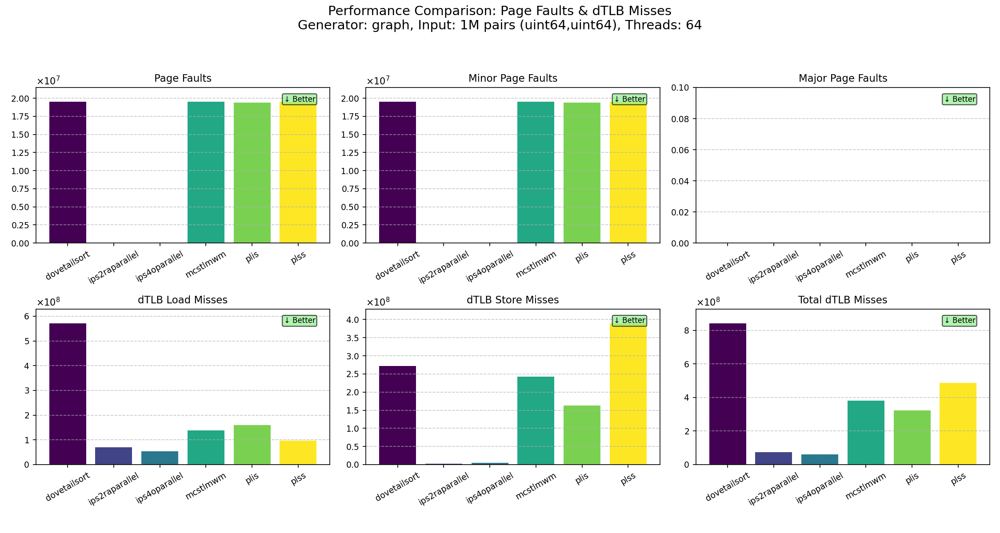

# Parallel algorithm Benchmark Suite
## Framework Introduction

The framework consists of three main parts:

1. **Hooking your algorithm**  
   You need to integrate your algorithm implementation using the provided interfaces (see `src/algorithm` and `src/benchmark`). Each algorithm will be compiled into an independent binary executable.

2. **Custom data generators**  
   To test on your own data distribution, you can add a new generator in `src/generator/generator.hpp`.

3. **Compilation and execution**  
   The compiler will compile all listed combinations of generators and data types/structures into your algorithm binary. To invoke a specific combination, you need to pass the corresponding parameters via the command line. Refer to `run_scripts/run_perf.sh` for an example. Parameters include data size, number of runs, generator name, data type, etc.

## Some Findings So Far

The observations indicate that sorting algorithms related to ParlayLib tend to incur significantly more page faults and dTLB misses.



Then I ran perf record and try to find what funtion produces the TLB miss ans page faults Dovetail PLIS PLSS. I can only get reasonable result for Dovetail and PLIS fornow, here's the findings.

The dTLB and page faults for Dovetail and PLIS both lies in the same ParlayLib internal file called `counting_sort.h`.

---
### **📄 Page Faults Analysis**

The `perf` log indicates that significant page faults occur within the `parlay::internal::seq_write_` function. This function is responsible for writing elements to their destination buckets during the sorting process.

**Target Function Causing Page Faults: `parlay::internal::seq_write_`**

Source code from `parlay::internal::counting_sort.h`:
```cpp
// write to destination, where offsets give start of each bucket
template <typename assignment_tag, typename InSeq, typename OffsetIterator, typename KeySeq>
void seq_write_(InSeq In, KeySeq Keys, OffsetIterator offsets, size_t num_buckets) {
  // copy to local offsets to avoid false sharing
  using oi = typename std::iterator_traits<OffsetIterator>::value_type;
  auto local_offsets = sequence<oi>::uninitialized(num_buckets);
  for (size_t i = 0; i < num_buckets; i++) local_offsets[i] = offsets[i];

  for (size_t j = 0; j < In.size(); j++) {
    oi k = local_offsets[Keys[j]]++;
    // needs to be made portable
    #if defined(__GNUC__) || defined(__clang__)
    if constexpr (is_contiguous_iterator_v<oi>)
       __builtin_prefetch (((char*) k) + 64);
    #endif
    assign_dispatch(*k, In[j], assignment_tag()); // Page fault hotspot
  }
}
```

**Direct Caller of `seq_write_`: `parlay::internal::count_sort_`**

The `seq_write_` function is invoked within a `parallel_for` loop inside `parlay::internal::count_sort_`. Each parallel task processes a block of data and calls `seq_write_` to distribute its elements.

Relevant code snippet from `parlay::internal::count_sort_` (in `counting_sort.h`):
```cpp
// Inside parlay::internal::count_sort_
parallel_for(0, num_blocks,
             [&](size_t i) {
               size_t start = (std::min)(i * block_size, n);
               size_t end = (std::min)(start + block_size, n);
               // This call to seq_write_ is where the page faults originate at a lower level
               seq_write_<assignment_tag>(In.cut(start, end), Keys.cut(start, end),
                                         dest_offsets.begin() + i * num_buckets, // Assuming dest_offsets is correctly defined
                                         num_buckets);
             },
             1, is_nested);
```

**Invocation within DovetailSort (implemented by `parlay::integer_sort2_`)**

In the context of the DovetailSort algorithm (as implemented by `parlay::integer_sort2_` in `our_integer_sort.h`), the specific `internal::count_sort_` call that leads to the problematic `seq_write_` invocation is the one used for distributing elements based on the `get_bits` (derived from the `lookup` lambda involving `heavy_id`). This occurs after the sampling and heavy/light key identification phase.

Relevant code snippet from `parlay::integer_sort2_` (in `our_integer_sort.h`):
```cpp
// Inside parlay::integer_sort2_
// ... (after sampling and definition of 'lookup' lambda and 'get_bits')

// This is the specific call to internal::count_sort_ in DovetailSort's logic
// that utilizes the 'get_bits' (with complex lookup) and subsequently calls
// the seq_write_ function leading to the observed page faults.
sequence<size_t> bucket_offsets;
bool one_bucket;
std::tie(bucket_offsets, one_bucket) = internal::count_sort_<assignment_tag, s_size_t>(
    In, Out, make_slice(get_bits), num_buckets, parallelism, true, light_id);
if (one_bucket) {
  integer_sort2_<s_size_t, inplace_tag, assignment_tag>(In, Out, Tmp, g, top_bits - log2_light_keys, parallelism);
  return;
}
```
**`perf` Log Corroborating the Hotspot in `seq_write_`:**

The `perf` log for page faults clearly points to `vmovups %xmm0,(%rax)` within `parlay::internal::seq_write_` as the instruction consuming 100% of the samples during the fault events. This instruction corresponds to `assign_dispatch(*k, In[j], assignment_tag());` in the C++ code. 

```cpp
Samples: 59K of event 'page-faults:u', 199 Hz, Event count (approx.): 19549587, Thread:
parlay::internal::seq_write_<parlay::uninitialized_relocate_tag, parlay::slice<pair_t*, pair_t*>, pair_t**, parlay::slice<parlay::delayed_sequence<unsigned short, unsign
Percent│         lea       0x10(%rax),%rcx
       │       for (size_t j = 0; j < In.size(); j++) {
       │         inc       %r10
       │       oi k = local_offsets[Keys[j]]++;
       │         mov       %rcx,(%rdx)
       │       // needs to be made portable
       │       #if defined(__GNUC__) || defined(__clang__)
       │       if constexpr (is_contiguous_iterator_v<oi>)
       │       __builtin_prefetch (((char*) k) + 64);
       │         prefetcht0 0x40(%rax)
100.00 │         vmovups   %xmm0,(%rax)
       │         add       $0x10,%rdi
       │       for (size_t j = 0; j < In.size(); j++) {
       │         cmp       0x28(%rsp),%r10
       │       ↑ jne       180
       │         mov       0x18(%rsp),%r12
       │       auto buffer_size = offsetof(header, data) + p->capacity * sizeof(value_type);
       │244:    mov       (%r12),%rax
```
---
### **🧠 dTLB Load Misses Analysis**

The `dTLB-load-misses` indicate that the processor frequently fails to find the virtual-to-physical address translation in the Translation Lookaside Buffer when trying to read data. This often happens with strided memory access patterns.

**Hotspot for dTLB Load Misses: Calculating Bucket Offsets in `parlay::internal::count_sort_`**

The primary C++ code section within `parlay::internal::count_sort_` that corresponds to the provided `dTLB-load-misses` `perf` log is the parallel loop responsible for calculating `bucket_offsets`. This loop iterates through each bucket and, for each bucket, sums up the counts from all blocks.

Relevant C++ code snippet from `parlay::internal::count_sort_` (in `counting_sort.h`):
```cpp
// Inside parlay::internal::count_sort_
// ... (after seq_count_ for each block populates the 'counts' array)

auto bucket_offsets = sequence<size_t>::uninitialized(num_buckets + 1);
parallel_for(0, num_buckets, // Outer loop iterates through buckets (i)
             [&](size_t i) {
               size_t v = 0;
               for (size_t j = 0; j < num_blocks; j++) { // Inner loop iterates through blocks (j)
                 v += counts[j * num_buckets + i]; // Strided access to 'counts' array - THIS IS THE ACTUAL CAUSE OF dTLB MISSES
               }
               bucket_offsets[i] = v;
             },
             1 + 1024 / num_blocks);
bucket_offsets[num_buckets] = 0; // Not directly in the hot loop but part of the overall logic
```
**`perf` Log Examples for dTLB-load-misses: (The comments are generated by ChatGPT)**

**Example 1: DovetailSort `perf` Log**
```cpp
Samples: 31K of event 'dTLB-load-misses', 59 Hz, Event count (approx.): 2255487705
parlay::fork_join_scheduler::parfor_<parlay::internal::count_sort_<parlay::uninitialized_relocate_tag, unsigned int, pair_t*, pair_t*, parlay::delayed_sequence<unsigned short, unsigned short, parlay::integer_sort2_<unsigned in
Percent│         shl   $0x2,%rsi                                                                      // Part of address calculation, possibly scaling an index by sizeof(type)
       │         lea   0x8(%r9,%rbx,4),%r9                                                              // Calculate effective address for %r9, likely base pointer for 'counts' array for current bucket i
       │       _ZZN6parlay8internal11count_sort_INS_26uninitialized_relocate_tagEjP6pair_tS4_NS_16delayed_sequenceIttZNS_14integer_sort2_IjSt17integral_constantIbLb1EES2_S4_S4_S4_ZN8DatatypeIS3_E15getKeyExtractorEvEUlRKS3_E_EEvN // Mangled symbol name indicating context
       │       for (size_t j = 0; j < num_blocks; j++) {                                              // C++ comment for conceptual inner loop
       │         xor   %r8d,%r8d                                                                      // Initialize inner loop counter j (likely %r8) to 0
       │         nop                                                                                    // No operation, often for alignment
       │       v += counts[j * num_buckets + i];                                                      // C++ code this loop implements
  7.49 │ c0:   mov   (%r9),%edi                                                                       // LOAD OPERATION: Read from 'counts' (address in %r9) into %edi. This is the dTLB miss trigger.
       │       for (size_t j = 0; j < num_blocks; j++) {                                              // C++ comment for conceptual inner loop
 43.88 │         inc   %r8                                                                            // Increment inner loop counter j. High % due to stall from previous 'mov'.
       │       v += counts[j * num_buckets + i];                                                      // C++ code context
       │         shl   $0x4,%rdi                                                                      // Shift left %edi (loaded count value), possibly scaling for an offset or type size.
       │       dest_offsets[j * num_buckets + i] = v;                                                 // C++ code context (likely from a different loop structure)
       │         mov   %rax,(%r10)                                                                    // STORE operation, likely to dest_offsets.
       │       _ZN6parlay19fork_join_scheduler7parfor_IZNS_8internal11count_sort_INS_26uninitialized_relocate_tagEjP6pair_tS6_NS_16delayed_sequenceIttZNS_14integer_sort2_IjSt17integral_constantIbLb1EES4_S6_S6_S6_ZN8DatatypeIS5_E // Mangled symbol name
       │       value_type* data() {                                                                   // C++ code context
 44.99 │         add   %rsi,%r9                                                                       // Pointer arithmetic: Advance %r9 by stride %rsi to point to counts[(j+1)*num_buckets+i]. High % due to stall.
       │       _ZZN6parlay8internal11count_sort_INS_26uninitialized_relocate_tagEjP6pair_tS4_NS_16delayed_sequenceIttZNS_14integer_sort2_IjSt17integral_constantIbLb1EES2_S4_S4_S4_ZN8DatatypeIS3_E15getKeyExtractorEvEUlRKS3_E_EEvN // Mangled symbol name
       │       v += counts[j * num_buckets + i];                                                      // C++ code context
  3.65 │         add   %rdi,%rax                                                                      // Accumulate: v (%rax) += scaled_counts_value (from %rdi)
       │       for (size_t j = 0; j < num_blocks; j++) {                                              // C++ code context
       │         add   %r13,%r10                                                                      // Pointer arithmetic for %r10 (dest_offsets pointer)
       │         cmp   %r8,%r11                                                                       // Compare inner loop counter j with num_blocks limit.
       │       ↑ jne   c0                                                                             // Loop back if j < num_blocks.
       │       _ZN6parlay19fork_join_scheduler7parfor_IZNS_8internal11count_sort_INS_26uninitialized_relocate_tagEjP6pair_tS6_NS_16delayed_sequenceIttZNS_14integer_sort2_IjSt17integral_constantIbLb1EES4_S6_S6_S6_ZN8DatatypeIS5_E // Mangled symbol name
       │ db:   inc   %rbx                                                                           // Increment for outer loop (bucket index i, likely in %rbx)
```

**Example 2: PLIS `perf` Log**
```cpp
Samples: 35K of event 'dTLB-load-misses', 59 Hz, Event count (approx.): 449610200
parlay::fork_join_scheduler::parfor_<parlay::internal::count_sort_<parlay::uninitialized_relocate_tag, unsigned int, pair_t*, pair_t*, parlay::delayed_sequence<unsigned long, unsigned long, parlay::internal::integer_sort_r<std // Symbol indicates context
Percent│       if (buffer != nullptr) {                                                               // C++ code context (likely start of the parallel task)
       │         mov   0x18(%rcx),%rax                                                                  // Initial setup/dereference
       │         shl   $0x2,%rdx                                                                      // Address calculation
       │         mov   (%rax),%rax                                                                    // Dereference
       │         test  %rax,%rax                                                                    // Null check
       │       ↓ je    c8                                                                             // Jump if null
       │         lea   0x8(%rax,%rbx,4),%rdi                                                          // Calculate effective address, %rdi becomes base for 'counts' for current bucket i
       │       _ZZN6parlay8internal11count_sort_INS_26uninitialized_relocate_tagEjP6pair_tS4_NS_16delayed_sequenceImmZNS0_14integer_sort_rISt17integral_constantIbLb1EES2_S4_S4_S4_ZN8DatatypeIS3_E15getKeyExtractorEvEUlRKS3_E_EENS // Mangled symbol name
       │       for (size_t j = 0; j < num_blocks; j++)bjdump:│         xor   %esi,%esi              // Initialize inner loop counter j (likely %esi) to 0
       │       size_t v = 0;                                                                          // C++ code context
       │         xor   %eax,%eax                                                                    // Initialize accumulator v (likely %eax) to 0
       │         nop                                                                                    // No operation
       │       v += counts[j * num_buckets + i];                                                      // C++ code this loop implements
  4.30 │ 80:   mov   (%rdi),%r9d                                                                      // LOAD OPERATION: Read from 'counts' (address in %rdi) into %r9d. dTLB miss trigger.
       │       for (size_t j = 0; j < num_blocks; j++)                                              // C++ comment for conceptual inner loop
 94.45 │         inc   %rsi                                                                         // Increment inner loop counter j. Very high % due to stall from previous 'mov'.
       │       v += counts[j * num_buckets + i];                                                      // C++ code context
       │         add   %r9,%rax                                                                       // Accumulate: v (%rax) += counts_value (%r9d)
       │       for (size_t j = 0; j < num_blocks; j++)                                              // C++ code context
  0.17 │         add   %rdx,%rdi                                                                      // Pointer arithmetic: Advance %rdi by stride %rdx to point to counts[(j+1)*num_buckets+i].
  1.08 │         cmp   %rsi,%r8                                                                       // Compare inner loop counter j with num_blocks limit.
       │       ↑ jne   80                                                                             // Loop back if j < num_blocks.
       │       bucket_offsets[i] = v;                                                                 // C++ code context
       │         mov   %rax,(%r10,%rbx,8)                                                             // STORE operation: bucket_offsets[i] = v, after inner loop.
       │       _ZN6parlay19fork_join_scheduler7parfor_IZNS_8internal11count_sort_INS_26uninitialized_relocate_tagEjP6pair_tS6_NS_16delayed_sequenceImmZNS2_14integer_sort_rISt17integral_constantIbLb1EES4_S6_S6_S6_ZN8DatatypeIS5_E // Mangled symbol name
       │         inc   %rbx                                                                           // Increment for outer loop (bucket index i, likely in %rbx)
```

**Explanation of `perf` Logs for dTLB Load Misses:**
* The symbols in both logs confirm execution within the parallelized `parlay::internal::count_sort_` function.
* The core loop causing dTLB load misses involves:
    * A **load operation** from the `counts` array (e.g., `mov (%r9),%edi` in Dovetail, `mov (%rdi),%r9d` in PLIS). The access pattern `counts[j * num_buckets + i]` is strided and is the **primary cause of the dTLB miss**.
    * Subsequent fast instructions like loop counter increments (e.g., `inc %r8` or `inc %rsi`) and pointer arithmetic for the next strided access (e.g., `add %rsi,%r9` or `add %rdx,%rdi`) show very high sample percentages. This is **not because they inherently cause misses**, but because the preceding load instruction has stalled the processor pipeline due to a dTLB miss (and potential cache misses). While the CPU is waiting for data, `perf` attributes the stalled cycles to these subsequent, often independent, instructions that are ready to retire or have just retired.
* The key takeaway is that the **strided memory access pattern** when reading the `counts` array (to implement `v += counts[j * num_buckets + i];`) is the root cause of the dTLB load misses. The high percentages on arithmetic instructions reflect the processor stalls caused by these memory access latencies.

---
### **💾 dTLB Store Misses Analysis**

The `dTLB-store-misses` event indicates that the processor frequently fails to find the virtual-to-physical address translation in the TLB when attempting to *write* data to memory. Similar to load misses, this can be exacerbated by strided write patterns.

**Hotspot for dTLB Store Misses: Populating `dest_offsets` Array in `parlay::internal::count_sort_`**

The primary source of `dTLB-store-misses` within `parlay::internal::count_sort_` is the parallel loop responsible for calculating and storing the precise destination iterators for each block's portion of each bucket. This involves writing to the `dest_offsets` array (which is of type `sequence<OutIterator>` and has a size of `num_blocks * num_buckets`). The `seq_write_` function later uses these pre-calculated iterators.

The `perf` C++ annotation `dest_offsets[j * num_buckets + i] = v;` (seen in the Dovetail log around the `mov %rax,(%r10)` instruction) directly corresponds to the store operation within this loop.

Relevant C++ code snippet from the complete `parlay::internal::count_sort_` function:
```cpp
// Inside parlay::internal::count_sort_
// Prerequisites:
// - `counts` array (size `num_blocks * num_buckets`) is populated with per-block-per-bucket counts.
// - `bucket_offsets` array (size `num_buckets + 1`) has been populated with total counts per bucket
//   and then scanned (e.g., via `scan_inplace`) to hold the global starting OutIterator for each bucket.
//   So, `bucket_offsets[i] + Out.begin()` gives the starting iterator in the output array `Out` for bucket `i`.

auto dest_offsets = sequence<OutIterator>::uninitialized(num_blocks * num_buckets);
parallel_for(0, num_buckets, // Outer loop iterates through buckets (variable 'i' is bucket_idx)
             [&](size_t i) {
               // 'v' is initialized with the global starting OutIterator for the current bucket 'i'.
               auto v = bucket_offsets[i] + Out.begin();
               for (size_t j = 0; j < num_blocks; j++) {   // Inner loop iterates through blocks (variable 'j' is block_idx)
                 // STORE OPERATION: Writing the calculated OutIterator 'v' to the dest_offsets array.
                 // The access pattern dest_offsets[j * num_buckets + i] is strided for fixed 'i' as 'j' increments,
                 // or for fixed 'j' as 'i' increments, leading to dTLB store misses.
                 dest_offsets[j * num_buckets + i] = v;
                 // Update 'v' by adding the number of elements from the current block 'j'
                 // that belong to the current bucket 'i', to prepare 'v' for the next block's portion of this bucket
                 // (or for this block's portion of the next bucket, depending on loop nesting in assembly).
                 v += counts[j * num_buckets + i];
               }
             },
             1 + 1024 / num_blocks);
// This dest_offsets array is then used by the subsequent parallel_for loop which calls seq_write_:
// e.g., seq_write_<...>(..., dest_offsets.begin() + block_idx_for_seq_write * num_buckets, ...);
```
The write `dest_offsets[j * num_buckets + i] = v;` is the strided store operation causing the dTLB misses.

**`perf` Log Examples for dTLB-store-misses:**

**Example 1: PLIS `perf` Log**
```cpp
Samples: 44K of event 'dTLB-store-misses', 59 Hz, Event count (approx.): 622459961
parlay::fork_join_scheduler::parfor_<parlay::internal::count_sort_<parlay::uninitialized_relocate_tag, unsigned int, pair_t*, pair_t*, parlay::delayed_sequence<unsi
Percent│         mov   (%rsi),%rsi                                                                         // Initial register setup or outer loop bookkeeping
       │       _ZN6parlay19fork_join_scheduler7parfor_IZNS_8internal11count_sort_INS_26uninitialized_relocate_tagEjP6pair_tS6_NS_16delayed_sequenceImmZNS2_14integer_s // Symbol context
       │         mov   (%r9),%r9                                                                           // Initial register setup
       │         test  %r8,%r8
       │       ↓ je    f8
       │         test  %r9,%r9
       │       ↓ je    148
       │         lea   0x0(,%rsi,8),%r13                                                                   // Address calculation
       │         lea   0x8(%r8,%rdi,1),%r10bjdump:│         shl   $0x2,%rsi                                 // Address calculation
       │         lea   0x8(%r9,%rbx,4),%r9                                                                   // %r9 is likely base for `counts` or for calculating `v`
       │       _ZZN6parlay8internal11count_sort_INS_26uninitialized_relocate_tagEjP6pair_tS4_NS_16delayed_sequenceImmZNS0_14integer_sort_rISt17integral_constantIbLb1E // Symbol context
       │       size_t end = (std::min)(start + block_size, n);                                             // Perf C++ annotation (nearby code)
       │         xor   %r8d,%r8d                                                                           // Initialize inner loop counter `j` (likely %r8) to 0
       │         nop
       │       dest_offsets.begin() + i * num_buckets,                                                      // Perf C++ annotation (related to how dest_offsets is used later)
  0.88 │ c0:   mov   (%r9),%edi                                                                            // LOAD `counts[j * num_buckets + i]` into %edi (part of `v += counts[...]`)
       │       size_t end = (std::min)(start + block_size, n);                                             // Perf C++ annotation
 97.48 │         inc   %r8                                                                                 // Increment inner loop counter `j`. High % due to stall from STORE.
       │       dest_offsets.begin() + i * num_buckets,                                                      // Perf C++ annotation
       │         shl   $0x4,%rdi                                                                           // Scale `counts` value (in %edi, result in %rdi)
       │       seq_write_<assignment_tag>(In.cut(start, end), Keys.cut(start, end),                         // Perf C++ annotation
  0.02 │         mov   %rax,(%r10)                                                                         // STORE `v` (in %rax) to `dest_offsets[j*num_buckets+i]` (address in %r10). dTLB Store Miss Trigger.
       │       _ZN6parlay19fork_join_scheduler7parfor_IZNS_8internal11count_sort_INS_26uninitialized_relocate_tagEjP6pair_tS6_NS_16delayed_sequenceImmZNS2_14integer_s // Symbol context
       │       value_type* data() {                                                                        // Perf C++ annotation
  1.01 │         add   %rsi,%r9                                                                            // Advance pointer for `counts` array. High % due to stall.
       │       _ZZN6parlay8internal11count_sort_INS_26uninitialized_relocate_tagEjP6pair_tS4_NS_16delayed_sequenceImmZNS0_14integer_sort_rISt17integral_constantIbLb1E // Symbol context
       │       dest_offsets.begin() + i * num_buckets,                                                      // Perf C++ annotation
  0.61 │         add   %rdi,%rax                                                                           // Update `v` (in %rax) using scaled `counts` value
       │       size_t end = (std::min)(start + block_size, n);                                             // Perf C++ annotation
  0.00 │         add   %r13,%r10                                                                           // Advance pointer for `dest_offsets` array.
       │         cmp   %r8,%r11                                                                            // Compare inner loop counter `j` with `num_blocks`
       // Perf log snippet ends before the jne, assuming it loops to c0
```

**Example 2: DovetailSort `perf` Log**
```cpp
Samples: 39K of event 'dTLB-store-misses', 59 Hz, Event count (approx.): 1144325020
parlay::fork_join_scheduler::parfor_<parlay::internal::count_sort_<parlay::uninitialized_relocate_tag, unsigned int, pair_t*, pair_t*, parlay::delayed_sequence<unsi
Percent│       _ZZN6parlay8internal11count_sort_INS_26uninitialized_relocate_tagEjP6pair_tS4_NS_16delayed_sequenceIttZNS_14integer_sort2_IjSt17integral_constantIbLb1E // Symbol context
       │         mov   (%rsi),%rsi
       │       _ZN6parlay19fork_join_scheduler7parfor_IZNS_8internal11count_sort_INS_26uninitialized_relocate_tagEjP6pair_tS6_NS_16delayed_sequenceIttZNS_14integer_so // Symbol context
       │         mov   (%r9),%r9
       │         test  %r8,%r8
       │       ↓ je    f8
       │         test  %r9,%r9
       │       ↓ je    148
       │         lea   0x0(,%rsi,8),%r13
       │         lea   0x8(%r8,%rdi,1),%r10
       │         shl   $0x2,%rsi
       │         lea   0x8(%r9,%rbx,4),%r9    // %r9 is likely base for `counts` or for calculating `v`
       │       _ZZN6parlay8internal11count_sort_INS_26uninitialized_relocate_tagEjP6pair_tS4_NS_16delayed_sequenceIttZNS_14integer_sort2_IjSt17integral_constantIbLb1E // Symbol context
       │       for (size_t j = 0; j < num_blocks; j++) { // C++ context from perf
       │         xor   %r8d,%r8d            // Initialize inner loop counter `j` (likely %r8) to 0
       │         nop
       │       v += counts[j * num_buckets + i]; // C++ context from perf (part of updating `v`)
  0.02 │ c0:   mov   (%r9),%edi             // LOAD `counts[j * num_buckets + i]` into %edi
       │       for (size_t j = 0; j < num_blocks; j++) { // C++ context
 76.36 │         inc   %r8                  // Increment inner loop counter `j`. High % due to stall from STORE.
       │       v += counts[j * num_buckets + i]; // C++ context
       │         shl   $0x4,%rdi            // Scale `counts` value (in %edi, result in %rdi)
       │       dest_offsets[j * num_buckets + i] = v; // Perf C++ annotation matching conceptual operation
  0.01 │         mov   %rax,(%r10)          // STORE `v` (in %rax) to `dest_offsets[j*num_buckets+i]` (address in %r10). dTLB Store Miss Trigger.
       │       _ZN6parlay19fork_join_scheduler7parfor_IZNS_8internal11count_sort_INS_26uninitialized_relocate_tagEjP6pair_tS6_NS_16delayed_sequenceIttZNS_14integer_so // Symbol context
       │       value_type* data() {         // C++ context
 23.31 │         add   %rsi,%r9             // Advance pointer for `counts` array. High % due to stall.
       │       _ZZN6parlay8internal11count_sort_INS_26uninitialized_relocate_tagEjP6pair_tS4_NS_16delayed_sequenceIttZNS_14integer_sort2_IjSt17integral_constantIbLb1E // Symbol context
       │       v += counts[j * num_buckets + i]; // C++ context
  0.31 │         add   %rdi,%rax            // Update `v` (in %rax) using scaled `counts` value
       │       for (size_t j = 0; j < num_blocks; j++) { // C++ context
  0.00 │         add   %r13,%r10            // Advance pointer for `dest_offsets` array.
       │         cmp   %r8,%r11             // Compare inner loop counter `j` with `num_blocks`
       // Perf log snippet ends before the jne, assuming it loops to c0
```

**Explanation of `perf` Logs for dTLB Store Misses (Revised):**
* The symbols indicate execution within `parlay::internal::count_sort_`.
* The critical instruction is `mov %rax,(%r10)` (with very low self-percentage like 0.01-0.02%), which performs the **store operation**. This is where the dTLB store miss is triggered. The C++ annotation `dest_offsets[j * num_buckets + i] = v;` (or similar) from `perf` accurately reflects the conceptual operation of writing a calculated destination iterator/pointer `v` (held in `%rax`) to a location in the `dest_offsets` array (address in `%r10`).
* The write access pattern `dest_offsets[block_idx * num_buckets + bucket_idx]` (as shown in the C++ code for populating `dest_offsets`) is **strided**, which is the primary cause of dTLB store misses.
* Similar to dTLB load misses, subsequent fast instructions (e.g., `inc %r8` and `add %rsi,%r9`) show high sample percentages. This is due to the preceding store instruction stalling the pipeline because of the dTLB miss. `perf` attributes the stalled cycles to these subsequent instructions.
* The low percentage of the `mov` store instruction itself, despite high event counts for dTLB store misses, suggests that while the TLB miss occurs, the subsequent handling or the overall impact on execution time relative to other operations in the loop (especially if dominated by stalls from prior load misses) might make its "self-time" appear small. However, the high count of `dTLB-store-misses` events confirms that these stores are indeed frequently missing the TLB.

## FIFO-Controlled Performance Tests

As described in the **Basic Performance Tests** section, the script `run_scripts/run_time_perfFIFO.sh` applies FIFO-controlled `perf` measurements.

The C++ program sends a disable signal to `perf` in the very beginning, enables it right before the sorting algorithm runs, and disables it immediately after execution. The initial warm-up round is NOT recorded by `perf`.

The script performs two tasks:

1. It uses `time` to record overall memory behavior and get a high-level overview.
2. It then uses `perf` to collect user-defined performance events, primarily focusing on memory-related metrics.

## Basic Performance Tests (Deprecated)

**Basic settings** (as configured in `run_scripts/run_perf.sh`):  
The framework fixes the total memory size rather than the number of elements. The memory size is set to 2^32 = 4,294,967,296 bytes. As a result, the number of elements varies depending on the data type.

I tested the following data types:  
DATATYPES=(uint32 uint64 pair)  
- `pair` refers to a structure of (uint64, uint64)

I tested with the following data generators:  
GENERATORS=(random zipf exponential almostsorted)

Performance tests were run using:  
`perf stat -e ${AVAILABLE_GROUP_EVENTS_STR} -- bash -c "numactl -i all ${ALGO_EXECUTABLE} [command parameters]"`

Each binary performs sorting 5 times per run. The `perf stat` results include the total statistics for all 5 rounds.  
Additionally, I ran a "do-nothing" sort (which performs everything except sorting, mainly to measure generator overhead). By subtracting its statistics, we can isolate the true cost of the sorting step.

`/analysis_scripts/analyze_main.py` will analysis the generated `perf` result, visualize them and it also generates a `feature_importance_wall_time.png` for reference.

**Summary**:
- The charts include performance statistics for 5 sorting rounds.
- Wall time is the average sorting time, excluding the first run (to avoid cold-start effects).
- To ensure accuracy, I ran each parameter setting 4 times, collecting different `perf` metrics each time.


## TODO

- [ ] Add Generator
    - [X] Implement graph generator (completed on 5/5/2025)
    - [ ] Implement database generator
- [] Add a way of detecting memory usage
- [X]  Add `perf` support (completed on 5/7/2025)
- [ ] Extend the `run.sh`
- [ ] Add interface for faster module selection
- [X] Ran sequential 
- [X] PAPI if possible (use FIFO to control perf) (completed on 5/14/2025)
- [] FIX python analysis scripts

## Below is the original IPS4o readme.

(todo update)
> We present a sorting algorithm that works in-place, executes in parallel, is
> cache-efficient, avoids branch-mispredictions, and performs work O(n log n) for
> arbitrary inputs with high probability. The main algorithmic contributions are
> new ways to make distribution-based algorithms in-place: On the practical side,
> by using coarse-grained block-based permutations, and on the theoretical side,
> we show how to eliminate the recursion stack. Extensive experiments show that
> our algorithm IPS⁴o scales well on a variety of multi-core machines. We
> outperform our closest in-place competitor by a factor of up to 3. Even as
> a sequential algorithm, we are up to 1.5 times faster than the closest
> sequential competitor, BlockQuicksort.

## Results

You compile the figures used in our publication by invoking the script `benchmark/compile_figures.sh`.
This command compiles LaTeX files stored in the folders [benchmark/distributions](benchmark/distributions) and [benchmark/running_times](benchmark/running_times).
After compilation, take a look at the generated PDF files.

The measurements are stored in [benchmark/running_times/results.7z](benchmark/running_times/results.7z).
To reinsert the results into the LaTeX files in [benchmark/running_timers](benchmark/running_timers), you have to decompress the measurements and analyze these using the data series processing tool [SqlPlotTools](https://github.com/ips4o/sqlplot-tools.git) published by [Timo Bingmann](https://algo2.iti.kit.edu/bingmann.php).
To do so, just call the script [benchmark/analyze_data.sh](benchmark/analyze_data.sh).
The script requires an installation of the SqlPlotTools connected to a PostgreSQL database and the file archiver 7-Zip.

## Usage

```
git clone https://github.com/ips4o/ips4o-benchmark-suite.git
cd ips4o-benchmark-suite
git submodule update --recursive --init
mkdir build
cd build
cmake ..
make all 
# make benchmark_ips4o benchmark_ips4ooldparallel benchmark_ips4oparallel benchmark_ips2ra benchmark_ips2raparallel
```

The executables `benchmark_ips4o` and `benchmark_ips4oparallel` execute the sequential/parallel version of IPS⁴o.
The executables `benchmark_ips2ra` and `benchmark_ips2raparallel` execute the sequential/parallel version of IPS²Ra.
For the usage of the benchmarks, we refer to the help function, e.g., `./benchmark_ips4o --help`.
Besides IPS⁴o and IPS²Ra, the benchmark suite contains many more sorting algorithms.
The benchmark `benchmark_ippradixsort` is disabled by default as it requires an installation of the [Intel® Integrated Performance Primitives (IPP)](https://software.intel.com/content/www/us/en/develop/tools/integrated-performance-primitives.html).
If you have installed IPP, you may enable the CMake property `IPPRADIXSORT`, e.g., via `ccmake`.
Some sorting algorithms require a compiler supporting the Cilk Plus C++ language extension.
Thus, make sure that your compiler supports Cilk Plus out of the box or add your own Cilk Plus library to the [CMakeLists.txt](CMakeLists.txt) file.
The sorting algorithms are loaded as submodules into the folder [extern](extern).
The file [authors](authors) lists the authors of the source code used in this benchmark suite.
Additionally, the file specifies for each submodule the url, authors, and license.

### Sequential Algorithms

The target names start with the prefix `benchmark_`.

Target Name | Name in Paper | Source | Note
--- | --- | --- | ---
benchmark_ips4o | I1S⁴o| [GitHub link](https://github.com/ips4o/ips4o) | Release Version
benchmark_ips2ra | I1S²ra | [GitHub link](https://github.com/ips4o/ips2ra)
benchmark_ps4o |1S⁴o | [GitHub link](https://github.com/ips4o/ps4o)
benchmark_skasort | SkaSort | [GitHub link](https://github.com/skarupke/ska_sort) |
benchmark_yaroslavskiy | DualPivot | [GitHub link](https://github.com/weissan/BlockQuicksort) |
benchmark_blockquicksort | BlockQ | [GitHub link](https://github.com/weissan/BlockQuicksort) |
benchmark_pdqsort | BlockPDQ | [GitHub link](https://github.com/orlp/pdqsort) |
benchmark_wikisort | WikiSort | [GitHub link](https://github.com/BonzaiThePenguin/WikiSort)
benchmark_timsort | Timsort | [GitHub link](https://github.com/timsort/cpp-TimSort) |
benchmark_stdsort | std::sort | GCC STL library |
benchmark_ssss | S⁴oS | [GitHub link](https://github.com/lorenzhs/ssssort) |
benchmark_quickxsort | QMsort | [GitHub link](https://github.com/weissan/QuickXsort) |
benchmark_ippradixsort | ippradix | [Website](https://software.intel.com/content/www/us/en/develop/tools/integrated-performance-primitives.html) |
benchmark_learnedsort | LearnedSort | [GitHub link](https://github.com/learnedsystems/LearnedSort) |

### Parallel Algorithms

The target names start with the prefix `benchmark_`.

Target Name | Name in Paper | Source | Note
--- | --- | --- | ---
ips4oparallel | IPS⁴o| [GitHub link](https://github.com/ips4o/ips4o) | Release Version
ips2raparallel | IPS²ra| [GitHub link](https://github.com/ips4o/ips2ra)
ps4oparallel |PS⁴o | [GitHub link](https://github.com/ips4o/ps4o)
ips4ooldparallel |IPS⁴oNT | [GitHub link](https://github.com/SaschaWitt/ips4o) | Previous Version
aspasparallel | ASPaS| [GitHub link](https://github.com/vtsynergy/aspas_sort)
raduls | RADULS2 | [GitHub link](https://github.com/refresh-bio/RADULS)
mcstlbq | MCSTLbq | GCC STL library | See also [MCSTL](https://algo2.iti.kit.edu/singler/mcstl/)
mcstlubq |MCSTLubq | GCC STL library | See also [MCSTL](https://algo2.iti.kit.edu/singler/mcstl/)
mcstlmwm | MCSTLmwm | GCC STL library | See also [MCSTL](https://algo2.iti.kit.edu/singler/mcstl/)
tbbparallelsort |TBB | [GitHub link](https://github.com/wjakob/tbb)
regionsort | RegionSort | [GitHub link](https://github.com/ips4o/parallel-inplace-radixsort)
pbbsradixsort | PBBS | [Website](http://www.cs.cmu.edu/~pbbs/) | See also [our GitHub fork](https://github.com/ips4o/pbbs-sorting)
pbbssamplesort | PBBR | [Website](http://www.cs.cmu.edu/~pbbs/) | See also [our GitHub fork](https://github.com/ips4o/pbbs-sorting)
imsdradix | IMSDradix | [Website](www.cs.columbia.edu/~orestis/) | See also [our GitHub fork](https://github.com/ips4o/InPlaceMSDradixsort)


## Reproducablity

The benchmarks have been executed on four machines.
On each machine, the benchmarks have been executed with

```
git clone https://github.com/ips4o/ips4o-benchmark-suite.git
cd ips4o-benchmark-suite
git submodule update --recursive --init
cd ./benchmark/running_times
./run.sh <machine-name>
```

in the folder [benchmark/running_times](benchmark/running_times).
After the benchmarks were executed, we analyzed the measurements with the script [benchmark/analyze_data.sh](benchmark/analyze_data.sh).
The script loads the measurements into a database and inserts the results into LaTeX files stored in the folder [benchmark/running_times](benchmark/running_times).
The script requires an installation of the [SqlPlotTools](https://github.com/ips4o/sqlplot-tools.git) published by [Timo Bingmann](https://algo2.iti.kit.edu/bingmann.php) connected to a PostgreSQL database and the file archiver 7-Zip.
The script expects the machine names `i10pc132`, `i10pc133`, `i10pc135`, and `i10pc136`.
The LaTeX files are included unmodified in the paper [In-place Parallel Super Scalar Samplesort (IPS⁴o)](https://arxiv.org/abs/1705.02257).
You may create PDF files for the figures of the paper by compiling the `*_plot.tex` files in [benchmark/running_times](benchmark/running_times) with `pdflatex` or by invoking the script [benchmarks/compile_figures.sh](benchmarks/compile_figures.sh).

For the `run.sh` command, you need an installation of the [Intel® Integrated Performance Primitives (IPP)](https://software.intel.com/content/www/us/en/develop/tools/integrated-performance-primitives.html) as well as Cilk Plus.
For Cilk Plus, you require a compiler supporting the Cilk Plus C++ language extension or you need provide your own Cilk Plus library which you add to the [CMakeLists.txt](CMakeLists.txt) file.


## Licensing

This benchmark suite is provided under the GPL-3.0 License described in the [LICENSE file](LICENSE).
If you use this benchmark suite in an academic setting please cite the [eponymous paper](https://arxiv.org/abs/1705.02257) (todo update) using the BibTeX entry

(todo update)
```bibtex 
@InProceedings{axtmann2017,
  author =	{Michael Axtmann and
                Sascha Witt and
                Daniel Ferizovic and
                Peter Sanders},
  title =	{{In-Place Parallel Super Scalar Samplesort (IPSSSSo)}},
  booktitle =	{25th Annual European Symposium on Algorithms (ESA 2017)},
  pages =	{9:1--9:14},
  series =	{Leibniz International Proceedings in Informatics (LIPIcs)},
  year =	{2017},
  volume =	{87},
  publisher =	{Schloss Dagstuhl--Leibniz-Zentrum fuer Informatik},
  doi =		{10.4230/LIPIcs.ESA.2017.9},
}
```
